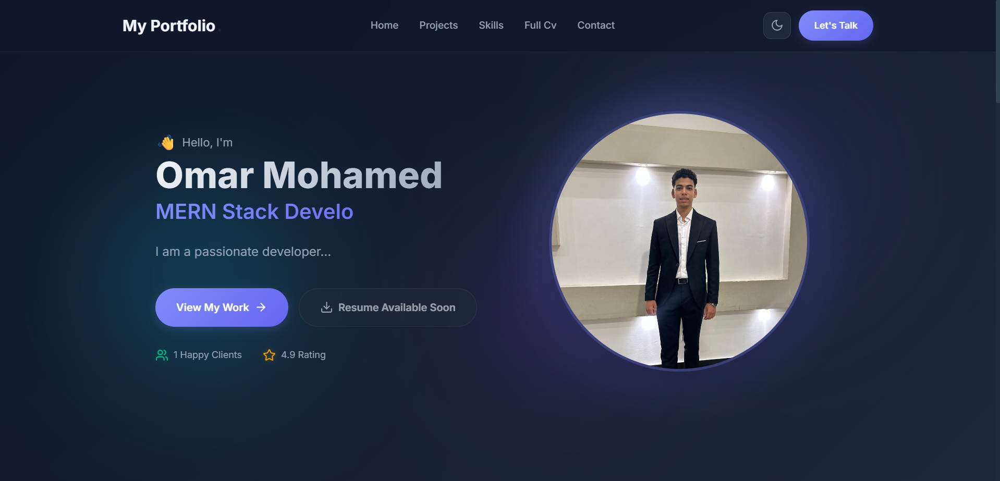
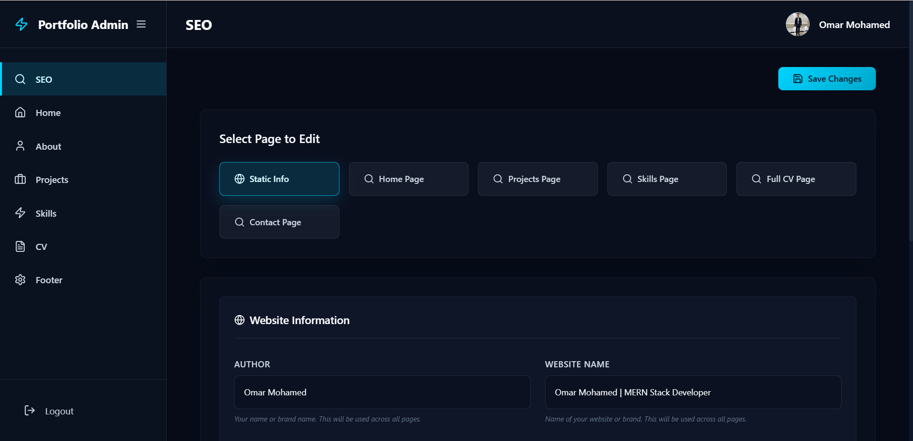

# 🚀 Omar Mohamed | Dynamic MERN Portfolio

This repository contains my fully dynamic, full-stack personal portfolio application built with the MERN stack. It features a separate backend and frontend, designed to showcase projects, skills, and resume details, all controllable via a secure Admin Dashboard.

## Visuals 🖼️

Here's a quick preview of my dynamic portfolio in action:

| Main Portfolio Page                                          | Admin Dashboard                                                     |
| ------------------------------------------------------------ | ------------------------------------------------------------------- |
|  |  |


## Table of Contents

- [Features](#features-)
- [Tech Stack](#tech-stack-)
- [Prerequisites](#prerequisites)
- [Environment Variables](#environment-variables)
- [Installation and Deployment](#installation-and-deployment)
- [Available Scripts](#available-scripts)
- [MongoDB Setup](#mongodb-setup)
- [Contact Page Configuration](#contact-page-configuration)
- [Connect with Me](#connect-with-me)

## Features ✨

This dynamic portfolio is built to be high-performing, secure, and easily manageable:

- **Dynamic Content Management**: 🚀 An intuitive admin dashboard allows for CRUD operations on projects, skills, SEO metadata, and CV updates without touching the codebase.
- **Dark & Light Mode**: 🌓 Seamless theme toggling with custom CSS variables for high-contrast UI/UX.
- **Responsive Design**: 📱 Modern and responsive design using CSS Grid/Flexbox, ensuring a seamless experience across all devices.
- **Contact Page**: 📧 Fully functional contact page using Resend API for direct communication.
- **Secure Admin Access**: 🔒 The admin panel is secured with encrypted passwords (Bcrypt) and JWT (JSON Web Token) authentication.
- **Contact Rate Limiting**: 🛡️ Implements rate limiting on the contact page to prevent abuse and spam.

## Tech Stack 🛠️

- **Frontend:** React.js (Vite), CSS Modules, Context API
- **Backend:** Node.js, Express.js, RESTful APIs
- **Database:** MongoDB (Mongoose)
- **Security:** JWT, Bcrypt, Rate Limiting
- **Third-party Services:** Cloudinary (Images), Resend (Emails)

## Prerequisites

Before you begin, ensure you have met the following requirements:

1. **Node.js** (LTS version recommended)
2. **MongoDB** (Local or MongoDB Atlas)
3. **Resend Account** (For contact form email delivery)
4. **JWT Secret Generator** (For backend security)

## Environment Variables

⚠️ **CRITICAL CONFIGURATION WARNINGS** ⚠️

Create a `.env` file in both the `server` and `client` directories based on the provided examples.

### Backend (`/server/.env`)

```env
BACKEND_PORT=5000
FRONTEND_PORT=3000
Mongo_URL=mongodb://127.0.0.1:27017/dynamic_portfolio  # Or your MongoDB Atlas URL
JWT_SECRET=your_jwt_secret_here
Admin_Url=admin
RESEND_API=your_resend_api_key
RESEND_MAIL_DOMAIN=                      # Leave empty if not using a custom domain
ADMIN_MAIL=your-verified@email.com       # Email receiving contact messages
CUSTOM_DOMAIN=                           # Leave empty for localhost
```

### Frontend (`/client/.env`)

```env
VITE_FRONTEND_ADMIN_URL=admin            # Must match Admin_Url from backend
VITE_BACKEND_ROOT_URL=http://localhost:5000  # Full path of backend server
```

## Installation and Deployment

Follow the steps below to run this project locally:

### Step 1: Clone the Repository

```bash
git clone https://github.com/omarmohamed-909/Portfolio.git
cd Portfolio
```

### Step 2: Backend Setup

```bash
cd server
npm install
```

After configuring your `.env` file, create the Admin User and Seed Default Data:

```bash
node create-admin
node setup
```

### Step 3: Frontend Setup

Open a new terminal window:

```bash
cd client
npm install
```

### Step 4: Run the Application

From the root directory, start both servers concurrently (if you have the root package.json configured), or run them separately:

**Backend:**

```bash
cd server
npm run dev
```

**Frontend:**

```bash
cd client
npm run dev
```

- Frontend: http://localhost:3000
- Admin page: http://localhost:3000/admin
- Backend API: http://localhost:5000

## Connect with Me 🤝

I'm always open to discussing web development, new projects, or potential opportunities.

- **Email:** om1478711@gmail.com
- **LinkedIn:** [Omar Mohamed](https://www.linkedin.com/in/omar-mohamed-454915298?utm_source=share_via&utm_content=profile&utm_medium=member_android)
- **GitHub:** [omarmohamed-909](https://github.com/omarmohamed-909)

---

Built with ❤️ by Omar Mohamed
