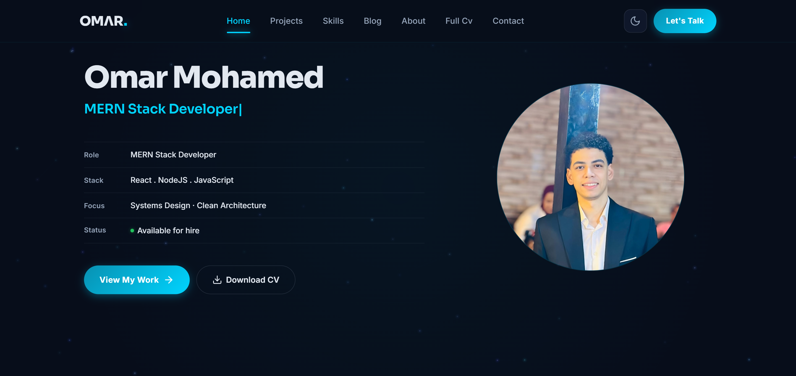
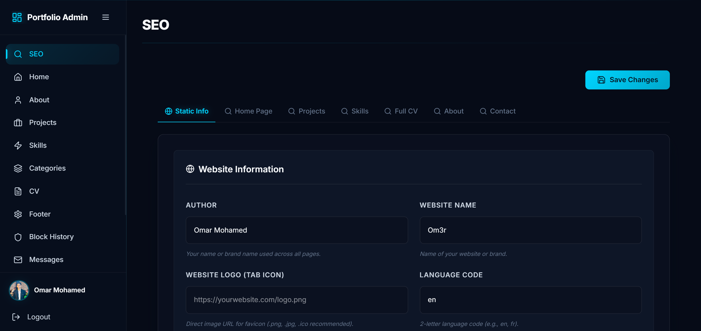

<div align="center">
  <h1>🚀 Dynamic MERN Portfolio & CMS</h1>
  <p><strong>The self-managing portfolio that needs no developer to update.</strong></p>

  <p>
    <a href="#live-demo">Live Demo</a> •
    <a href="#the-problem--solution">The Problem</a> •
    <a href="#architecture">Architecture</a> •
    <a href="#engineering-highlights">Engineering</a> •
    <a href="#getting-started">Getting Started</a>
  </p>

  
  
  
  
  
</div>

---

## 🛑 The Problem vs. 🟢 The Solution

Developer portfolios often become a maintenance trap. Every time you want to add a project, update a skill, or fix a typo, you have to open the codebase, edit JSX files, commit, and redeploy. 

**This project solves that by transforming a static portfolio into a living platform.**

| ❌ Static Portfolios | ✅ This Dynamic Portfolio |
| :--- | :--- |
| **Add a project**: Edit JSX → commit → deploy | **Add a project**: Click "Add" in the Admin Dashboard |
| **Write a blog post**: Create markdown file → push | **Write a blog post**: Use the rich-text editor in the dashboard |
| **Update SEO**: Hunt through component code | **Update SEO**: Set meta tags per page via the SEO panel |
| **Read messages**: Check server logs or 3rd party apps | **Read messages**: Dashboard inbox + auto-email via Resend |
| **Time to update**: 15+ minutes | **Time to update**: Under 60 seconds |

---

## 🌟 Live Product & Demos

This is real, running software. Experience the difference:

### Public Site
Browse projects, read posts, and explore skills — every word and image is served live from MongoDB, editable at any time from the dashboard.
👉 **[omarombark.me](https://omarombark.me)**

### Admin Dashboard (CMS)
A full Content Management System in your hands. Create, edit, and delete projects and blog posts with rich media support. Changes reflect on the live site instantly — no build step, no deployment.

| Main Portfolio Page | Admin Dashboard |
| :---: | :---: |
|  |  |

---

## 🏛️ Architecture: Under the Hood

Clean, layered, and decoupled architecture.

* **Client Layer**: React (Vite) powering both the public site and the Admin Dashboard. They share the same API and single source of truth.
* **Network Layer**: HTTPS, strict CORS, and JWT Bearer tokens stored securely in `HttpOnly` Cookies.
* **API Layer**: Express REST API protected by role-based authorization middleware (RBAC guards on every write endpoint).
* **Application Layer**: Business logic separated into controllers, services, and validation schemas.
* **Infrastructure Layer**: MongoDB (Mongoose) for data, Cloudinary for image storage, and Resend for email delivery.

---

## 🧠 Engineering Highlights

The hard parts, done right. This project is built to production-grade standards.

### 🔐 Role-Based Access Control (RBAC) + JWT
Three distinct roles (**Admin**, **Viewer**, and **Public**) enforced on every endpoint. Viewer accounts (designed for safe live demos) hit a `403 Forbidden` on any mutation attempt—enforced server-side, with no exceptions.

### 🏗️ Secure Cross-Domain Cookie Auth
Tokens are never stored in `localStorage`. JWTs are stored in `HttpOnly` cookies, making them immune to XSS token theft. Configured with `SameSite=None` and `Secure` to allow cross-domain authentication between the Vercel frontend and DigitalOcean backend.

### 🛡️ XSS Prevention & Security Headers
All user-generated content (like rich-text blog posts) is sanitized using **DOMPurify** before DOM injection. **Helmet** enforces a strict Content Security Policy (CSP) as a second layer of defense.

### 🔍 Dynamic SEO injected via React
React is client-rendered, meaning meta tags often don't exist on first load for crawlers. This is solved by fetching server-aware SEO data per route and injecting it dynamically using `react-helmet`.

### 🖼️ Media Pipeline & Email Integration
**Cloudinary** handles all image uploads, returning optimized URLs, transformations, and thumbnails automatically. The **Resend API** delivers contact form submissions directly to the dashboard inbox and your personal email in real-time.

---

## 🛠️ Tech Stack

**🖥️ Frontend**
* React 19 · Vite · Tailwind CSS · Framer Motion · Radix UI · React Router

**⚙️ Backend**
* Node.js · Express · JWT · bcrypt · Helmet · DOMPurify · CORS

**🗄️ Data & Services**
* MongoDB · Mongoose · Cloudinary · Resend API

---

## 📊 By the Numbers

* **2** Platforms (Web UI + REST API)
* **3** User Roles (Admin, Viewer, Public)
* **5+** Content Modules (Projects, Blog, SEO, Skills, Messages)
* **25+** REST Endpoints
* **100%** Dynamic Content (Zero redeployments needed to update content)

---

## 🚀 Getting Started

Follow these steps to run the complete platform locally.

### Prerequisites
1. **Node.js** (LTS version recommended)
2. **MongoDB** (Local or Atlas)
3. **Cloudinary Account** (For image uploads)
4. **Resend Account** (For email delivery)

### 1. Clone the Repository
```bash
git clone https://github.com/omarmohamed-909/Portfolio.git
cd Portfolio
```

### 2. Environment Variables
Create a `.env` file in both the `/server` and `/client` directories.

**`/server/.env`**
```env
BACKEND_PORT=5000
FRONTEND_PORT=3000
Mongo_URL=mongodb://127.0.0.1:27017/dynamic_portfolio
JWT_SECRET=your_jwt_secret_here
Admin_Url=admin
RESEND_API=your_resend_api_key
ADMIN_MAIL=your-verified@email.com
CLOUDINARY_CLOUD_NAME=your_cloud_name
CLOUDINARY_API_KEY=your_api_key
CLOUDINARY_API_SECRET=your_api_secret
```

**`/client/.env`**
```env
VITE_FRONTEND_ADMIN_URL=admin
VITE_BACKEND_ROOT_URL=http://localhost:5000
```

### 3. Backend Setup
```bash
cd server
npm install
node create-admin # Creates the initial admin user
node setup # Seeds default SEO and Home data
npm run dev
```

### 4. Frontend Setup
Open a new terminal window:
```bash
cd client
npm install
npm run dev
```

**Access Points:**
- Public Site: `http://localhost:3000`
- Admin Dashboard: `http://localhost:3000/admin`
- API Root: `http://localhost:5000`

---

## 🤝 Let's Connect

Available for questions and a live walkthrough.

* **Email:** om1478711@gmail.com
* **LinkedIn:** [Omar Mohamed](https://www.linkedin.com/in/omar-mohamed-454915298)
* **Website:** [omarombark.me](https://omarombark.me)

<div align="center">
  <sub>Built with ❤️ by Omar Mohamed</sub>
</div>
